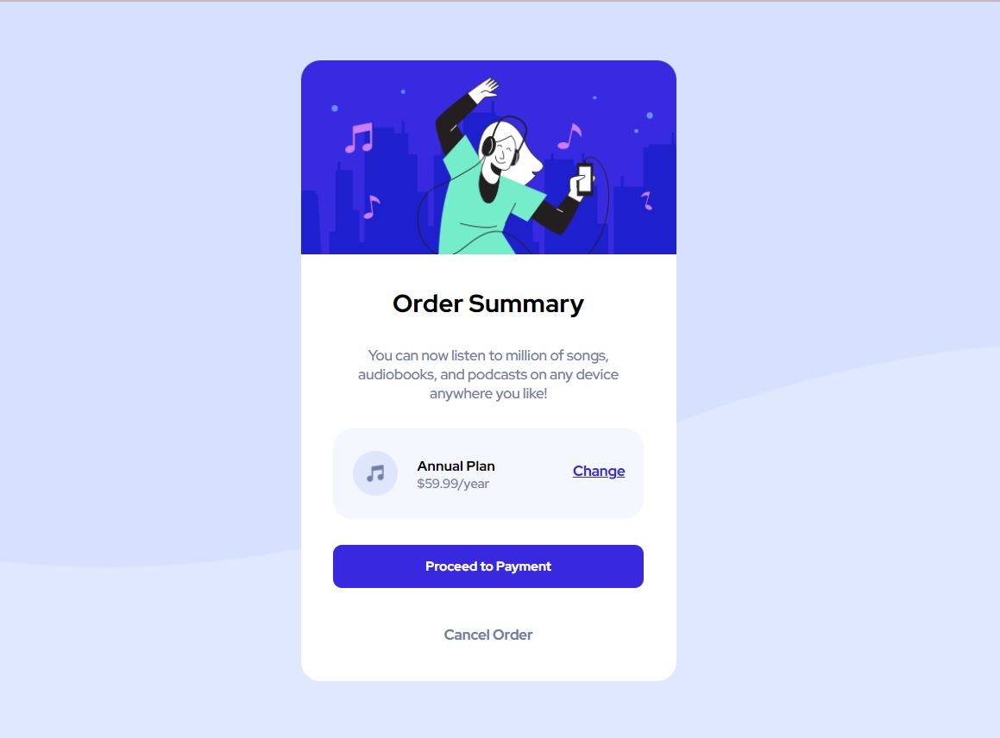

# Order Summary Component

This project is a simple web page created as a solution to the "Order Summary Component" challenge provided by [Frontend Mentor](https://www.frontendmentor.io/challenges/order-summary-component-QlPmajDUj). The web page allows users to view an order summary and proceed to payment.



You can access the live demo of this project here [Order Summary Component](https://mehwishjbe.github.io/order-summary/).

## Table of Contents

- [Features](#features)
- [Built With](#built-with)
- [Getting Started](#getting-started)

## Features

- Display an order summary.
- Allows users to change their subscription plan.
- Provides options to proceed to payment or cancel the order.

## Built With

- HTML5
- CSS3

## Getting Started

To get a local copy up and running, follow these simple steps:

1. Clone the repository to your local machine:

   ```bash
   git clone https://github.com/mehwishjbe/order-summary.git
